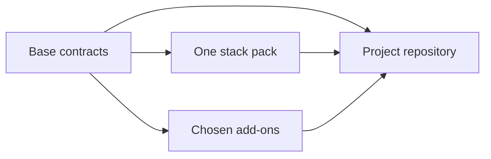

# Visual Stack project template

**Start with the engineering decisions already made.**

The Visual Stack project template gives people and AI agents the same working agreement for a
full-stack codebase. It defines where code belongs, how a change moves from specification to
production, what quality gates apply, and what must be verified before the work is done.

Most starter repositories give you generated code and leave the important decisions for later.
This template starts with the decisions that should outlast the first implementation. Choose one
stack, keep the capabilities the product needs, and build inside a contract that remains readable
as the codebase grows.

There is no generator to run and no application to install. The template is a set of plain files
that becomes the project repository.

Built by [Cavalry Collective](https://cavalry.sg) for
[Visual Stack](https://github.com/Cavalry-Collective/visual-stack).

---

## A point of view, not a universal answer

There is no one-size-fits-all way to design and build software. This template does not pretend
otherwise. It reflects only Cavalry Collective's design and software engineering philosophy:
define boundaries early, keep important decisions visible, work in small verifiable slices, and
treat design and engineering as one continuous practice.

It is an opinionated starting point, not a standard every project should follow. Adapt it to the
people, product, and constraints in front of you. If this way of working resonates with you, thank
you. We are glad you found something useful here.

---

## Start a project

Click **Use this template** on GitHub, create a repository, and complete the
[Day-1 setup](#day-1-setup).

Or install [Visual Stack](https://github.com/Cavalry-Collective/visual-stack) and run
`/vstack:start` for guided setup.

The setup leaves each project with:

1. the base architecture and delivery contracts;
2. one concrete stack pack;
3. only the optional capabilities that the product needs;
4. real development, CI, and deployment commands.

After setup, the files left in the repository are the source of truth.

---

## How the template works

The base defines the shape of the system without tying it to a framework. A stack pack supplies
the libraries, package manager, database toolchain, and deployment model. Add-ons introduce the
extra rules required by capabilities such as billing, multi-tenancy, or LLM calls.



The contracts are placed beside the work they govern. A person can read them as engineering
documentation. Claude Code loads the relevant `CLAUDE.md` when it works in that area.

| Path | What it governs |
| --- | --- |
| [`CLAUDE.md`](CLAUDE.md) | Project architecture, workflow, quality gates, and Definition of Done |
| [`apps/backend/`](apps/backend/) | Domain, services, repositories, controllers, and backend testing |
| [`apps/frontend/`](apps/frontend/) | State, services, pages, components, design tokens, and frontend testing |
| [`db/`](db/) | Database access, reversible migrations, seeds, and resets |
| [`infra/`](infra/) | Terraform structure, infrastructure safety, and verification |
| [`design/`](design/) | The token-driven visual baseline confirmed before screen work begins |
| [`specs/`](specs/) | Short feature specifications written before implementation |
| [`stacks/`](stacks/) | Framework and platform bindings for one concrete stack |
| [`add-ons/`](add-ons/) | Optional capability contracts kept only when the project adopts them |

---

## Choose a stack

A project keeps exactly one stack pack. The pack records its Day-1 changes, local commands, CI
requirements, deployment model, and every place where it must override the base contract.

| Pack | Application |
| --- | --- |
| [`django`](stacks/django/README.md) | React SPA, Django REST API, and Postgres |
| [`enterprise`](stacks/enterprise/README.md) | Server-first Next.js, separate NestJS API, Prisma, and Postgres |
| [`mern`](stacks/mern/README.md) | React SPA, Express API, and MongoDB |
| [`vercel-csr`](stacks/vercel-csr/README.md) | React SPA, Fastify API, Postgres, and Vercel |
| [`vercel-ssr`](stacks/vercel-ssr/README.md) | One full-stack Next.js application on Vercel with Postgres |
| [`wechat`](stacks/wechat/README.md) | Taro H5, Fastify, MySQL, and Tencent Cloud |

See [Stack packs](stacks/README.md) for the binding and conflict rules.

---

## Add capabilities

A project may keep any number of add-ons. Keeping a directory adopts its contract. Delete every
add-on the project does not need.

| Add-on | What it adds |
| --- | --- |
| [`test-mode`](add-ons/test-mode/README.md) | Safe sinks for external side effects |
| [`otp-auth`](add-ons/otp-auth/README.md) | Passwordless login and contact verification |
| [`llm-calls`](add-ons/llm-calls/README.md) | Guardrails for product features that call an LLM |
| [`premium-design`](add-ons/premium-design/README.md) | Art direction, motion, and a higher visual craft bar |
| [`enterprise-compliance`](add-ons/enterprise-compliance/README.md) | Security, privacy, recovery, and governance controls |
| [`multi-tenancy`](add-ons/multi-tenancy/README.md) | Organisation isolation across the application |
| [`saas-billing`](add-ons/saas-billing/README.md) | Plans, subscriptions, entitlements, seats, and usage |
| [`seo`](add-ons/seo/README.md) | Crawlable and indexable public pages |

Each add-on defines what the capability must do. The active stack pack supplies the concrete
implementation. See [Optional add-ons](add-ons/README.md) for prerequisites and adoption rules.

---

## Day-1 setup

Complete this once when creating a project.

1. **Create and clone the repository.** Use this template on GitHub, then open
   `project.code-workspace`.
2. **Read the contracts.** Start with the root [`CLAUDE.md`](CLAUDE.md), then read the contracts
   under `apps/backend/`, `apps/frontend/`, `db/`, and `infra/`.
3. **Adopt one stack pack.** Follow its Day-1 instructions and delete the other pack directories.
   Copy its development commands into the root `CLAUDE.md`, record the pack under **Learnings**,
   and use its CI section in step 5.
4. **Choose the add-ons.** Keep the capabilities the project needs, confirm their prerequisites,
   and delete the others.
5. **Wire the toolchain.**
   - Replace every command placeholder in the root `CLAUDE.md`.
   - Copy `.github/workflows/examples/ci.yml.example` to `.github/workflows/ci.yml` and implement
     every active gate.
   - Delete `.github/workflows/template-integrity.yml`. It protects this source template, not the
     generated project.
   - Add `.github/workflows/deploy.yml` only when the chosen pack requires it and the deployment
     target is configured.
   - Add a real `.env.example`.
6. **Set the visual baseline.** Declare the primary form factor in `apps/frontend/CLAUDE.md`.
   Rebrand `design/tokens.css`, open `design/design-guide.html`, and confirm the visual system
   before building screens.
7. **Add runtime configuration.** Restore the local environment and secrets. Stand up staging when
   the chosen pack defines one.
8. **Run the complete suite.** Push the configured project and confirm that its first CI run is
   green.
9. **Protect `main`.** Require the project CI check, block force pushes and deletion, and keep
   history linear. Configure this after the first successful run so the required check exists.

Finally, confirm that no setup marker remains:

```bash
grep -rn 'FILL IN ON SETUP\|TODO:' . \
  --exclude-dir=stacks --exclude-dir=specs --exclude-dir=.git \
  | grep -v '^\./README\.md:'
grep -n '^<pm> ' CLAUDE.md
grep -rn '^ *# *- name:' .github/workflows/
```

All three commands should return nothing. Replace this README with the product's own README when
setup is complete.

---

## From specification to verified change

For each non-trivial change:

1. Write a short specification under `specs/`.
2. Build the smallest independently shippable slice.
3. Run the relevant lint, typecheck, tests, build, migration, accessibility, and visual checks.
4. Observe the result in the running product.
5. Rebase and merge only when the integrated change is green.

The base contract stays framework-independent unless the retained stack pack says otherwise. An
add-on becomes a requirement only when the project keeps it.

---

## Why plain files

Generated scaffolding dates quickly. Architecture boundaries, delivery rules, and verification
standards last much longer.

Keeping those decisions in the repository makes them visible, reviewable, and available to the
people and agents doing the work. No service owns the project contract. No hidden state is required
to understand it. The template provides the engineering house style. The project supplies the
product.

---

## Support

- Found a wrong or contradictory rule? [Open an issue](https://github.com/Cavalry-Collective/vstack-template-base/issues).
- Want to contribute? Read [`CONTRIBUTING.md`](CONTRIBUTING.md).
- Found a security problem? Follow [`SECURITY.md`](SECURITY.md) and report it privately.

Projects created from this template are maintained by their owners. Community participation is
governed by [`CODE_OF_CONDUCT.md`](CODE_OF_CONDUCT.md).

## License

[MIT](LICENSE). A project created from the template may replace this license with its own.
